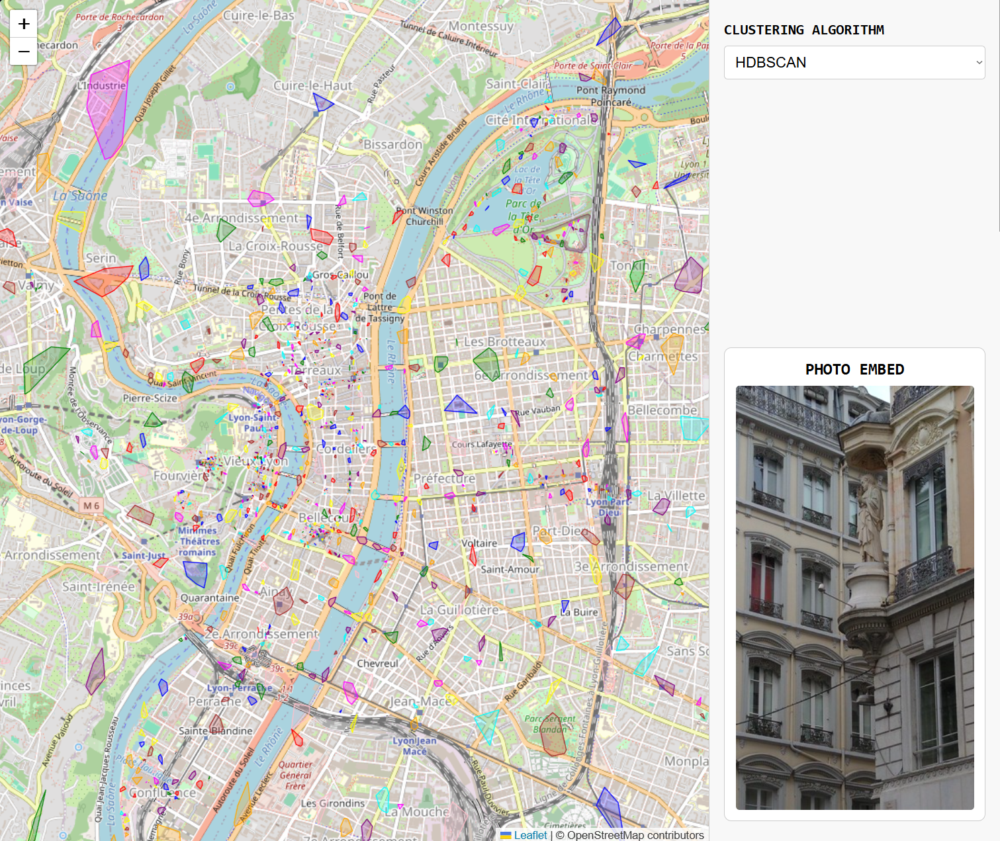

# Flickr-Clustering
This project revolves around implementing, analyzing, and visualizing clustering techniques in a user-friendly manner. The dataset utilized is sourced from the Flickr gallery. The primary focus is on utilizing clustering algorithms to group similar images based on their features and applying Natural Language Processing (NLP) techniques for labeling and categorizing the clustered data using the posts' titles and tags. The project aims to explore various clustering methods, evaluate their performance, and provide insights into the underlying patterns within the Flickr dataset.

## Results
The project successfully implemented clustering techniques to group similar images from the Flickr dataset. The NLP component provided meaningful labels and categories for the clustered data, enhancing the interpretability of the results. The results can be seen on their respective notebooks, in various plots and charts, demonstrating the effectiveness. Overall, the project showcased the potential of combining clustering and NLP techniques to analyze and understand large datasets effectively.



## Installation
To run this project, you need to have Python (with pip) and Node (tested on v25.2.1, with npm 11.6.2) installed on your machine. Installing Python isn't necessary if you only want to run the Node.js application, but it is required for the clustering and NLP components of the project.

You can install the dependencies using the following commands. 

From the root of the project, run:
```bash
pip install -r requirements.txt
```

From the `node-app` directory, run:
```bash
npm install
```

## Usage
To run the clustering and NLP components, you'll have to access each of the Jupyter notebooks in the `notebooks` directory. You can start Jupyter Notebook from the root of the project using:
```bash
jupyter notebook
**This will open a web interface where you can navigate to the `notebooks` directory and open the desired notebook.
```

To run the Node.js application, navigate to the `node-app` directory and execute:
```bash
npm start
```

